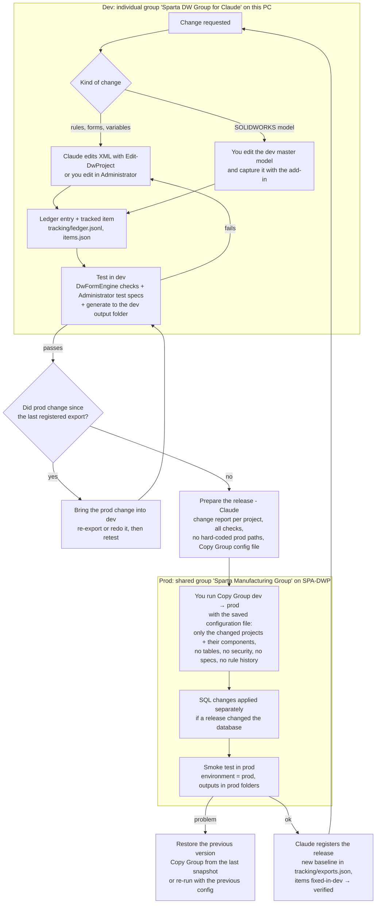

# Dev → prod workflow for the DriveWorks projects

## Decisions (2026-10-05)

- **Two environments only: dev and prod.** No staging or test group.
- **Dev stays the individual group** `Sparta DW Group for Claude` in this repo's `DriveWorks Files`, while there's one developer. We'll revisit when a second developer joins (see "Two or more developers").
- **Environment settings live in one group table, `Environments`,** with one row per group. Each project has **one base variable** that says whether it's running in prod or dev, and its other environment values come from the table. Tracked as `env-no-hardcoded-prod-locations`, which fails today on 49 rules in 17 projects.
- **Releases copy only the projects being released,** as below.
- **2026-10-06:**
  - the `Environments` table and the `IsProductionEnvironment` variable were created in **prod** first;
  - dev may write to the production SQL database for now, so both table rows use `192.168.0.19\SQLEXPRESS`, and the SQL export documents stay unchanged;
  - the rule changes are listed in [environment-changes.md](environment-changes.md).

## Selecting what to copy

**Copy only the projects in the release, never everything.** Copying all projects would overwrite production with whatever dev holds for projects nobody released: unfinished work, stale copies, test values. It's also what allows two or three developers to release independently.

Each release selects:
- **Projects:** the released ones only. Add a hosted child (for example Start Leg) only if the release changed it.
- **Components:** "Automatically select all components in the selected Projects". DriveWorks skips files that are identical in prod, so only changed or new models are copied.
- **Group tables:** none. Exception: `Environments`, when a release adds a value, since it holds every group's row and is safe to copy. Any other table is copied only when its *structure* changed, after merging prod's rows into it.
- **Everything else:** off (security, specifications, reports, tasks, released files, rule history).

**Tested 2026-10-05** (prod → dev, every project but Apron). The copied projects were replaced byte for byte, Apron was untouched, and identical models were skipped. `ClientProjects` was replaced, losing a row dev had and prod didn't. Details are in `docs/learnings.md`.

**What a project-only release doesn't cover**, so the release report checks it:
- **Shared models.** The components of a project include common parts used by other projects. If dev has an unreleased change to one of them, it goes to prod with this release and affects those projects too. The report lists every copied model that differs from prod, and the other projects that use it.
- **Hosted children.** A parent can depend on a child's new input or constant. The report flags parent ↔ child references that don't exist in prod.
- **Group tables and SQL.** A project that needs a new table column or database column needs that change released first.
- **Dev drifting from prod.** With one developer, dev is prod plus your work. With several individual dev groups, everyone has to pull the others' releases from prod (Copy Group prod → own dev, released projects only).

*Proposal, 2026-10-05. Based on DriveWorks' Copy Group documentation (sources at the end), on what `DriveWorks.Engine.dll` 24.0.1.4 shows, and on the audit of hard-coded locations in our 17 projects. Nothing here is in place yet except the export tracking.*

*Update 2026-10-09: the first dev → prod release ran on 2026-10-09 at 13:03–13:12 (−03:00): all 18 projects, one Copy Group, components auto-selected. It's logged in [`tracking/releases.json`](../../tracking/releases.json) (`Register-DwRelease`), with its note in [`tracking/copy-group/2026-10-09-dev-to-prod.md`](../../tracking/copy-group/2026-10-09-dev-to-prod.md). The `Environments` table and `IsProductionEnvironment` were already in production (since 2026-10-06).*

## The workflow

## Answers

**Which tool deploys: Copy Project or Copy Group?** **Copy Group**, run from Data Management. *Copy Project* makes a duplicate of a project, under a new name and folder, inside the same group, for example to start a new product from an existing one. It doesn't deploy between groups. Copy Group copies between any two groups, including individual → shared (it "upscales" the data). DriveWorks names development → staging → production as one of its purposes.

**Do we export everything every time?** No. Copy Group lets you tick **individual projects**, **individual group tables** and the **components** to copy (automatically, all the components of the selected projects, or chosen by hand). It also skips files that are already identical in the target ("File … is the same as the target file and will not be copied"). So a one-project release copies that project and the model files it changed. Be aware that common parts and library models can be shared by several projects: copying them also updates them for the other projects. The release report should list which other projects use them.

**Copy Group settings for a dev → prod release:**

| Step / option | Setting | Why |
|---|---|---|
| Source | the dev group (you are logged in to it) | |
| Target | the existing prod group on SPA-DWP | |
| Target Root Folder | the prod content folder (J: / `\\192.168.0.19\Driveworks Input Files`) | It must differ from the source root. Files go to the same relative paths under it. |
| Projects | only the projects in the release | |
| Rule history | **off** | DriveWorks advises against copying rule revisions to production |
| Components | "Automatically select all components in the selected Projects" | new and re-captured models go with the project |
| Group tables | **none**, unless the release changed a table on purpose | a copied table **replaces** the target's data, so ClientProjects or Colors would lose every row prod added and gain dev's test rows |
| Copy New Security Users and Teams | **off** | prod owns users and teams |
| Copy All Specifications / Reports / Tasks / Released Files and Information | **off** | test data, and very large |
| File selection | review it; untick `Specifications`, test outputs and anything not in the release | |
| Save configuration | **yes**, one XML file per release, kept in the repo | the same release can be re-run or reviewed later |

**What doesn't get copied (or must be handled separately):**
- **Not copied by DriveWorks:** Business Objects, Localizations, and files managed by SOLIDWORKS PDM unless they're checked out first. If the prod masters on J: are in PDM, check them out before the copy and check them in after.
- **Kept by the target:** the target group keeps its own name, content folder and specification folder. Copy Group remaps component paths to the target root.
- **Outside DriveWorks altogether:** the SQL database (SpartaDWdata: table or column changes go by script), Pro Server settings (Integration Themes, Autopilot, connections), and files referenced by absolute paths outside the root folder (the `C:\Sparta SW Vault` libraries).

**How a project knows it's in dev or prod:** one rule per project, but based on the **group name**, not a file location. DriveWorks has the rule function `GetGroupName()` ("Gets the Group name"), and Copy Group doesn't rename the target group. Put the per-environment values in **one group table, `Environments`, with a row per group**:

| GroupName | Environment | InputRoot | OutputRoot | DbServer | DbServerDW |
|---|---|---|---|---|---|
| Sparta Manufacturing Group | Prod | `\\192.168.0.19\Driveworks Input Files\` | `\\192.168.0.19\Driveworks Output Files\` | `192.168.0.19\SQLEXPRESS` | `192.168.0.19\SQLEXPRESSDW` |
| Sparta DW Group for Claude | Dev | `<repo>\DriveWorks Files\` | `<repo>\DriveWorks Files\Specifications\` | `192.168.0.19\SQLEXPRESS` (for now) | `192.168.0.19\SQLEXPRESSDW` (for now) |

Each project then looks up its row by group name. The exact rules are in [environment-changes.md](environment-changes.md):
- **Every location variable uses the lookup:** input and output folders, `FilePath`, the Drive3D locations and `DataBaseServer`. If the dev location moves, one table row changes.
- **Rules that point straight at an input file (form pictures, a Drive3D file) become relative paths.** DriveWorks resolves them against the project's folder in either group. Because the table holds **both** rows, copying it dev → prod does no harm. If a group is missing from the table, release should be blocked, so it fails safe. Before rolling this out:
1. Check that `GetGroupName()` works in the individual dev group (a test rule in Administrator).
2. Check what it returns on SPA-DWP.

**Shared vs individual dev group.** Keep the **individual** dev group, because Claude's tools need the group and projects as local files. Add a **shared test group** on SPA-DWP when you need to test DriveWorks Live, the website, team security or Autopilot before release. It gets its own row in `Environments` and fits between dev and prod in the diagram.

## Two or more developers

DriveWorks has no merge. **The unit of work is the project:** in a shared group, only one person can have a project open in Administrator, and the others see who has it open and on which PC. A project can still be *run* by any number of users. So the rule is one person per project at a time, and coordinate everything that several projects share.

**What several projects share:**
- common models and library parts;
- hosted child projects (Start Leg in Kit Conveyor and Light Duty; Straight, Picking, both HandRails and Bolts in Platform Layout; Kit Conveyor and Platform Layout in Order);
- group tables, the `Environments` table, `ProjectStyles.css` and images.

**Recommended setup with 2+ developers: one shared dev group** on a server, with its own content folder, output folder and dev database, plus prod. Everyone works in the same dev group.
- DriveWorks' project lock stops two people editing the same project.
- A change to a shared model is seen by everyone right away, and nobody has to re-sync private copies.
- It's the same platform as prod, so it doubles as the test group.
- Claude's tools have to be adapted for it: they would read the group from SQL Server, read-only, instead of a local SQLite file. Claude would edit project files in the dev content folder only when the project isn't open. A local individual group stays available for Claude's experiments.

**The alternative, one individual dev group per developer,** works when people never touch the same projects or models. Each of you releases only your own projects. After every release, the others refresh their dev group from prod, picking only the released projects and components, so their own unfinished work isn't overwritten. It gets fragile as soon as two people change a shared model or a hosted child.

**Rules for either setup:**
- **Ownership:** each change is a tracked item with an owner and its projects. The item list shows who is working on what.
- **Shared assets:** changes to common models, hosted children and group tables are agreed first and released on their own, before the projects that need them.
- **Small releases:** one project per release where possible. The release report lists the shared models a release copies and every other project that uses them.
- **Releases one at a time:** after each release, the new prod baseline is registered before the next one is prepared.

## Tooling to build

1. **`Test-DwEnvironmentSafety`**: a check that no rule outside the environment lookups references `192.168.0.19`, a drive letter or a personal folder, and that every email and SQL export document reads the environment. It becomes a tracked item, so a release can't ship with a hard-coded prod path.
2. **`New-DwRelease -Project …`**: prepares a release.
   - Change report: each project in dev against the last registered prod export.
   - Tracked-item checks.
   - The models it copies and the other projects that use them.
   - The **Copy Group configuration file** with the settings above.

   The template is the configuration saved from the 2026-10-06 prod → dev copy, `tracking/copy-group/2026-10-06-prod-to-dev.xml`, which is plain XML (format in `docs/learnings.md`). You still run the Copy Group: production is off-limits to the tools.
3. **`Register-DwRelease`**: after the release, records the copied projects as the new prod baseline, without overwriting dev work on other projects.
4. *Later, optional:* DriveWorks' Specification Flow task "Copy Group on a Specified Source Group" runs a saved configuration file from a project on Pro Server. A "Deploy" project could run releases with an approval step. That's an alternative to running Data Management by hand.

## Sources

- [Copy Group](https://docs.driveworkspro.com/topic/DataManagementCopyGroup) and [How To Use Copy Group](https://docs.driveworkspro.com/topic/DataManagementHowToCopyGroup) (DriveWorks documentation)
- [Copy Group on a Specified Source Group](https://docs.driveworkspro.com/topic/SppTaskCopyGroupOnASpecifiedSourceGroup) (Specification Flow task)
- [Info: Individual and Shared Groups](https://docs.driveworkspro.com/topic/InfoIndividualAndSharedGroups), [Understanding Groups and Projects](https://docs.driveworkspro.com/topic/UnderstandingGroupsandProjects)
- `DriveWorks.Engine.dll` 24.0.1.4: `CopyGroupResources` (action descriptions), `TitanDesignMasterProFunctions.GetGroupName`
