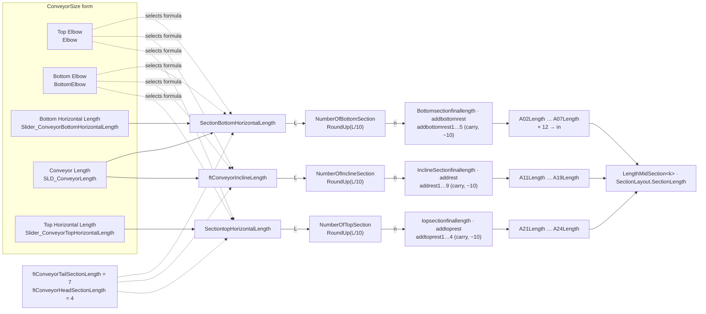

# DW Apron Project: sections, lengths, shipping assemblies

*Read from `DriveWorks Files/Apron/DW Apron Project.driveprojx` as saved 2026-09-23 13:01. Unsaved Administrator edits are not included. Reproduce the findings with `Get-DwModelRule`, `Get-DwRuleDependency` and `Find-DwRule`.*

## 1. Sections and when they exist

Along the conveyor: **A01** tail → **A02–A07** bottom run → **A10** bottom elbow → **A11–A19** incline → **A20** top elbow → **A21–A24** top run → **A29** head.

The mid sections are all copies of one model, `DW10-A02`:

| Copies | Component sets | Output names |
|---|---|---|
| Bottom run | `DW10-A02`, `DW10-A02-2` … `DW10-A02-6` | `A02`–`A07` |
| Incline | `DW10-A02-11` … `DW10-A02-19` | `A11`–`A19` |
| Top run | `DW10-A02-21` … `DW10-A02-24` | `A21`–`A24` |

Each component set's name rule decides whether the section exists. In the table below, *n*, *m* and *t* are the run counts from §2:

| Section | Exists when | Output name |
|---|---|---|
| A01 tail | not **No Tail** | `*<prefix>-A01` (constant `TailSectionAsmNumber`) |
| A02–A07, copy k = 1…6 | `bottomconstatmult` (*n*) > k−1 | `*<prefix>-A0(k+1)` |
| A10 bottom elbow | **Bottom Elbow** and not **No Elbow** | `*<prefix>-A10` |
| A11–A19, copy j = 1…9 | **Bottom Elbow** and `constatmult` (*m*) > j−1 | `*<prefix>-A1j` |
| A20 top elbow | **Top Elbow** and not **No Elbow** | `*<prefix>-A20` |
| A21–A24, copy i = 1…4 | **Top Elbow** and `topconstatmult` (*t*) > i−1 | `*<prefix>-A2i` |
| A29 head | not **No Head** | `*<prefix>-A29` |

**Planned change (2026-09-28), prepared but not yet in the project:** each mid-section file-name rule reads its own row of the `SectionLayout` Enable column:

```
=If( DWVLookup( "A03" , DWCalcSectionLayout , 1 , TableGetColumnIndexByName( DWCalcSectionLayout , "Enable" ) , FALSE )
	,DWVariablePrefixMidSection2
	,"Delete" )
```
- Apply it with `tools/scripts/Set-ApronMidSectionFileNameRule.ps1`.
- Enable then has to carry the elbow tests that the old rules had: **Bottom Elbow** for A11–A19 and **Top Elbow** for A21–A24.
- The two sub-assembly file-name rules inside each section (`PrefixMidSection<n>` and `… & " Tables"`) still test the count.

A few more rules:
- `<prefix>` is `PrefixClientWO`, which comes from the `EquipmentName` input.
- The `DW10-A03` component set is permanently deleted (`TRUE=TRUE`). It is a leftover.
- There are also modes on the Settings form: Tail Only, Head Only, Elbow Only.

## 2. Run lengths (ft)

| Run | Configuration | Length to fill with mid sections |
|---|---|---|
| Bottom (`SectionBottomHorizontalLength`) | Straight | `ConveyorLength − 7 − 4` (tail and head) |
| | Top elbow only | `ConveyorLength − 7` |
| | Bottom elbow (with or without top) | `BottomHorizontalLength − 7` |
| Incline (`ftConveyorInclineLength`) | Both elbows | `ConveyorLength` |
| | Bottom elbow only | `ConveyorLength − 4` (the head sits on the incline) |
| Top (`SectiontopHorizontalLength`) | Top elbow | `TopHorizontalLength − 4` |

- **Inputs** (ConveyorSize form, all 1 ft steps):
  - `SLD_ConveyorLength`: max 71 straight, **108** with any elbow
  - `Slider_BottomHorizontalLength`: max 67
  - `Slider_ConveyorHorizontalLength` (top): max 60
- **Elbow lengths are not subtracted** from any run. The elbow's own length is `47.4376 × tan(angle)` (`bottomelbowlength` / `topelbowlength`).

## 3. Count and split

The same algorithm runs three times:

| Run | Count | Base | Remainder | Cascade | Section lengths |
|---|---|---|---|---|---|
| Bottom | `bottomconstatmult` | `Bottomsectionfinallength` | `addbottomrest` | `addbottomrest1…5` | `A02Length…A07Length` |
| Incline | `constatmult` | `midsectionfinallength` | `addrest` | `addrest1…9` | `A11Length…A19Length` |
| Top | `topconstatmult` | `topsectionfinallength` | `addtoprest` | `addtoprest1…4` | `A21Length…A24Length` |

```
count     = RoundUp(L / 10, 0)            ← 10 hard-coded
base      = RoundDown(L / count, 0)       (guarded with ftMaximumSectionLength)
remainder = Mod(L, count)
section 1 = base + remainder, capped at 10; overflow (…rest1 = base+rem−10) moves to section 2, etc.  ← 10 hard-coded
A0xLength = (base + incoming overflow − outgoing overflow) × 12      → inches
LengthMidSection<k> = A0xLength
```

Examples (bottom run):
- 23 ft → 9 · 7 · 7
- 31 ft → 10 · 7 · 7 · 7
- 39 ft → 10 · 10 · 10 · 9
- 45 ft → 9 × 5

Lengths are always **whole feet** (`Mod` needs integers).

**The split does not enforce a minimum length.** A 1 ft run gives a single 1 ft section. It does guarantee **≥ 5 ft whenever there are 2+ sections** at a 10 ft max, or ≥ 4 ft at 8 ft, because run > max × (count − 1). The **3 ft minimum comes from the slider minimums** combined with the "Add Bottom/Top Horizontal Section" checkboxes, so every run is either 0 or at least 3 ft:

| Run | How the 3 ft minimum is reached |
|---|---|
| Straight | Conveyor Length min 14 → 14 − 7 − 4 = 3 ft |
| Top elbow only | Conveyor Length min 10 → 10 − 7 = 3 ft |
| Bottom run with a bottom elbow | Checkbox off → length 7 → run 0. Checkbox on → min 10 → run 3 ft. |
| Incline | min 7 − 4 (bottom elbow only), or min 3 (both elbows) → 3 ft |
| Top run | Checkbox off → 4 → run 0. Checkbox on → min 7 → run 3 ft. |

`ftMinimumSectionLength = 3` exists, but the sliders use hard-coded numbers instead of it.

**Trap:** the `…finallength` guard uses `ftMaximumSectionLength`, while the count uses a literal `/10`. If you change only the constant (for example to 8), the guard fails and the base becomes 0. A 39 ft run would come out as 3·0·0·0. All the 10s must change together.

### Flow from form inputs to `A..Length` (names as saved 2026-09-28)

There is a rendered version with a worked example at https://claude.ai/artifact/Fm5aYyzQpFBzn6bJDqL18k. It is private to the owner until shared.



### How a length reaches the model
In each copy, `LengthMidSection<k>` drives:
- **Direct dimensions:**
  - `MidsectionSidePlateLength` on the side plates (`-K1-BL`, `-K2-BL` parts and the `-K1/K2-6NF` parts)
  - `SkirtingLength = L/2 − 0.0435` on `-K0-3LP-BL`
- **About 50 lookups on exact lengths**, keyed on 120, 108, 96, 84, 72, 60, 48 and 36 in. They set:
  - cross-brace pattern count and spacing, bottom supports, bolts
  - the impact bed (108/120 only)
  - the access door and E-stop (≥ 60)
  - the oiler (≥ 96)
  - decals

  Any whole-foot length from 3 to 10 ft is covered, so an 8 ft maximum still works.

### Fixed sections
- **Tail:** 7 ft (`ftConveyorTailSectionLength`). Also defined as `ConveyorTailSectionLength = 84` and variable `ApronTailSectionLength = 84.125`.
- **Head:** 4 ft (`ftConveyorHeadSectionLength`). Also defined as `ConveyorHeadSectionLength = 44.80`, `ApronHeadSectionLength` (constant) = 44.80 and variable `ApronHeadSectionLength = 48`. **These four values don't agree.**
- **Elbows:** `47.4376 × tan(angle)` in inches. There's also `ConveyorElbowSectionLength = 36`.

## 4. Where the maximum section length lives today

- **Constants:** `ftMaximumSectionLength = 10` is used by 3 rules (the `…finallength` guards). `MaximumSectionLength = 120` is used by 1 rule (legacy `A08Length`). `ftMinimumSectionLength = 3` and `MinimumSectionLength = 36` are **not used**.
- **The literal `10`** appears in:
  - `bottomconstatmult`, `constatmult`, `topconstatmult` (`/10`)
  - `addbottomrest1–5`, `addrest1–9`, `addtoprest1–4` (`>10`, `−10`)
  - the unused-looking `calobs`
- **Implicit capacity** is the number of copies × 10 ft:

| Run | Copies | Capacity at 10 ft | At 8 ft | Sliders allow |
|---|---|---|---|---|
| Bottom | 6 | 60 ft | 48 ft | 60 straight / bottom elbow ✓; **101 ft** with top elbow only ✗ |
| Incline | 9 | 90 ft | 72 ft | **108 / 104 ft** ✗ |
| Top | 4 | 40 ft | 32 ft | **56 ft** ✗ |

  No rule or `Error` property warns when a run exceeds its copies. Those sections are simply not built.
- **Making the maximum configurable means:**
  1. Replace every literal 10 with `DWConstantftMaximumSectionLength`.
  2. Derive `MaximumSectionLength` from it (× 12) or delete it.
  3. Make the slider maximums follow copies × maximum.
  4. Add copies where the capacity must stay the same. Unused A-numbers are available: A08–A09 and A25–A28.

## 4b. Proposed variable names (2026-09-25; do the renames in Administrator)

Units are a **suffix** (`FT` / `IN`) so names stay grouped by meaning in Administrator's alphabetical list. The three totals are the length the mid sections must fill (tail and head removed). Elbows are never subtracted, so the inputs must be measured between elbows.

| Today | Proposed |
|---|---|
| `SectionBottomHorizontalLength` / `ftConveyorInclineLength` / `SectiontopHorizontalLength` | `TotalBottomMidSectionLengthFT` / `TotalInclineMidSectionLengthFT` / `TotalTopMidSectionLengthFT` |
| `bottomconstatmult` / `constatmult` / `topconstatmult` | `NumberOfBottomMidSections` / `NumberOfInclineMidSections` / `NumberOfTopMidSections` |
| `Bottomsectionfinallength` / `midsectionfinallength` / `topsectionfinallength` | `BottomMidSectionBaseLengthFT` / `InclineMidSectionBaseLengthFT` / `TopMidSectionBaseLengthFT` |
| `addbottomrest` / `addrest` / `addtoprest` | `BottomMidSectionRemainderFT` / `InclineMidSectionRemainderFT` / `TopMidSectionRemainderFT` |
| `addbottomrest1…5` | `CarryIntoA03FT…A07FT` |
| `addrest1…3`, `DWVariableaddrest4`, `addrest5…8` | `CarryIntoA12FT…A19FT` |
| `addrest9` | `CarryPastA19FT` (should never be > 0) |
| `addtoprest1…3` | `CarryIntoA22FT…A24FT` |
| `addtoprest4` | `CarryPastA24FT` (> 0 means the top run is too long for 4 copies) |
| constant `ftMaximumSectionLength` / `ftMinimumSectionLength` | `MaxMidSectionLengthFT` / `MinMidSectionLengthFT` |
| constant `ftConveyorTailSectionLength` / `ftConveyorHeadSectionLength` | `TailSectionLengthFT` / `HeadSectionLengthFT` |
| constant `MaximumSectionLength` (120) | Delete it, or make it a **variable** `MaxMidSectionLengthIN = MaxMidSectionLengthFT*12`. Constants can't be computed. |

"Bottom" deliberately leaves out "Horizontal": in straight and top-elbow-only builds the bottom run isn't horizontal.

**Delete** (unreferenced):
- `calobs`
- `LengthMidSection7…10`: they are stale and point at A08, A11, A12 and A13
- `A08Length`: used only by `LengthMidSection7`

**Keep:** `A0xLength` and `LengthMidSection<k>`. The latter has about 4,000 model references; the calc table can feed it later.

## 4c. Unused variables (`Find-DwUnusedVariable`, file saved 2026-09-23 13:01)

**99 of 309** variables are unused: 70 have no reference at all, and 29 are used only by other unused variables. Re-run the tool after saving new edits. Delete them in Administrator, starting with the unreferenced ones, then re-run.

- **Unreferenced (70)**, by category:
  - **Apron Layout:** `ActualTotalLength`, `calobs`, `calobs1`, `ElbowPlusHeadLength`, `HorizontalOverallLenghtHead`
  - **Belt:** `BeltDescription`, `BeltFinish`
  - **Drawing:** `DXFPNEtching`, `OutputDXFFlatState`, `OutputPDF`, `OutputStepFileBendParts`
  - **Elbow Option Var:** `BottomLengthAfterElbow`, `ElbowSidePlateBottomLength`, `HorizontalHeadLocation`
  - **Email:** `ApplicationEngineerEmail`
  - **FileNaming:** `PrefixElbowSection`, `PrefixMidSection7…10`
  - **Forms:** `3DViewerWidth`, `BackgroundGreyDW`, `BottomElbow`, `FontColorDW`, `HeaderFontColorDW`, `LeftSideFrameHeight`, `LeftSideSingleFrameHeight`
  - **Inputs:** `Bidirectional`, `ConveyorStickerName`, `FlowTPH`, `MaterialDensity`, `MaterialSizeMax`, `MaterialSizeMin`, `MaterialType`, `MotorAngleOffset`, `MotorAtHead`, `Pullcord`, `TailShaftDiameter` (its rule is `TypeBeltReturn`, which looks wrong), `Trajectory`, `TrajectoryHeight`
  - **Material:** `MaterialStainless`, `MaterialSteel`
  - **Motor:** `ClincherDescriptionGearbox`, `EndShaftDiameterGearmotor`, `GearboxEndShaftLength`, `GearboxPlaneLocationFromEndOfShaft`, `HelicalBevelMotorConfiguration`, `HelicalBevelODDim`, `HelicalGearboxTorqueArmOffset`, `HelicalTableFiltered`, `VFD`
  - **Options:** `Anchors`, `CutThroughOnMotorMount`, `Emergencys`, `emergencystop`, `oilerprefix`
  - **Output File Path:** `DXF`, `MaterialPathNameSideBeltSupport`, `PDFDrawings`, `PDFFabKits`, `PDFParts`, `PDFTables`, `SpecificationPath`, `Step`
  - **Setting:** `DataLine`
  - **sketchs:** `nblinkSA3`
  - **UserAndTeam:** `IsUserInSparta`
  - **Uncategorised:** `boltvar1`, `TailLength`, `WeldedNutTakeUp`
- **Only used by unused variables (29):**
  - `bottomelbowlength`, `topelbowlength` (used only by `ActualTotalLength`, so nothing live uses the elbow lengths)
  - `TotalLength`
  - `BeltFinishDescription`, `BeltSplice`
  - `BottomInclineLength`, `HorizontalBottomElbowLocation`, `HorizontalHeadLocationNoElbow`, `HorizontalHeadLocationWithElbow`, `ConveyorHorizontalLength`, `ElbowAngle`
  - `PrefixNameMidSection7…10`
  - `QTSideBeltSupport`, `MaterialSideBeltSupport`
  - `ClincherEndShaftLength`, `HelicalDistanceInsideGearboxToSnapRing`, `HelicalGearboxThickness`, `MotorDiam`
  - The chain-link count per SA: `nblink`, `nblinkSA1`, `nblinkSA2`, `SA1SketchLength`, `SA2SketchLength1`, `SA2SketchLength2`, `SA3SketchLength`, `shape1sketchLength`
- **`calobs` / `calobs1`** are the first incline section (A11) and first bottom section (A02) length **in feet**. They always equal `A11Length/12` and `A02Length/12`. They look like leftover check or draft values: `calobs` inlines the overflow formula that `addrest1` later took over.
- The same two variables, and the **whole split series** (`bottomconstatmult`, `constatmult`, `addrest…`), also exist in **DW Hopper Project**, where they are unused too. The Apron logic was probably copied from Hopper.
- So the constant and rename rework may apply there as well.

**Treated as used:** the 23 `LengthMidSection*` variables, because of `Indirect("DWVariableLengthMidSection"&…)`. `LengthMidSection7…10` are probably stale anyway (§4b).
- **Not checked:** references from other projects (parent/child specifications) and external document templates.

## 4d. Changes reviewed 2026-09-28 (production project saved 09-28 12:12, copied into the sandbox)

Compared with the 2026-09-23 package using `Compare-DwProjectContent`.

**Renamed**
- Variables:
  - `constatmult` → `NumberOfInclineSection`
  - `bottomconstatmult` → `NumberOfBottomSection`
  - `topconstatmult` → `NumberOfTopSection`
  - `MidsectionLength` → `InclineSectionLength`
  - `midsectionfinallength` → `InclineSectionfinallength`
- Controls:
  - `Slider_BottomHorizontalLength` → `Slider_ConveyorBottomHorizontalLength`
  - `Slider_ConveyorHorizontalLength` → `Slider_ConveyorTopHorizontalLength`
  - `BottomHorizontalLength` → `ConveyorBottomHorizontalLength`
  - `ConveyorHorizontalLength` → `ConveyorTopHorizontalLength`
- Component set `DW10-A02` → `DW10-A02-1`.
- Category `add_rest` → `MidSectionLengthCalculation`, with more variables moved into it.
- The slider defaults changed: bottom 21 → 10, top 19 → 7.

**Deleted**
- Variables `calobs`, `calobs1`, `ElbowPlusHeadLength`, `TailLength`
- Calc table `Midsection`

**Added**
- `MaxWeigthInShippingAssy` = 10000
- Weight variables for the tail, both elbows and the head, by width. All are placeholders = 1.
- Data table `MidSectionWeigthNoChain`: length 48–120 in × width 36–84
- Calc table `SectionLayout`: 29 rows A01…A29 with columns Enable, MidSectionNumber, SectionLength, Estimated Weight, CumulativeWeightInSA, ShippingAssembly, and SA1…SA5enable

**Model rules**
- The belly-pan rules (`DW10-2LBP/3LBP-YL-YD`, `DW10-Belly Pan Bolts`) are gone from all 19 mid-section copies (494 rules). The `DW10-A02` capture has no belly-pan children, so DriveWorks probably pruned them on save. Belly pans are still placed at the top-assembly and elbow/head level.
- Every capture reference in the new project resolves in the sandbox group.

**Issues found**
1. **Broken replace.** `SA1 (Apron Conveyor Assembly V2)` `DummyASMA -2` still points to `<Replace>DW10-A02` after the set rename. This affects straight and bottom-elbow-only builds.
2. **SectionLayout: Enable is empty on every mid-section row**, so their Estimated Weight is 0.
3. **SectionLayout: row A10's weight uses `WeigthNoChainTailSection`** (copy-paste).
4. **SectionLayout: the fixed-row weights ignore Enable**, so an elbow's weight counts even when that elbow doesn't exist.
5. **SectionLayout: rows A08/A09 reset CumulativeWeightInSA to 0**, and A25–A28 carry `"False"` weights into the cumulative sum.
6. **SectionLayout: the weight limit is tested one row late** (on the previous row's total), so every SA can overshoot by one section.
7. **SectionLayout: the A29 own-SA test uses `ConveyorWidth > 48`**, which is not the 102 in rule, and it skips the weight check.
8. **SectionLayout: SectionLength mixes feet** (A01, A10) and inches (A20, the mid sections), and A29 is `"False"`.
9. **Weight table:**
   - 48 in × 48 wide = **113**, which is probably a typo for about 1130–1175.
   - There is no 36 in row, but a one-section run can be 36 in.
10. **Spelling mix:** `Weigth` vs `Weight` across the new names.
11. **SA1…SA5enable** are still empty (next step). A20 and A29 are forced to False in every SA column.
12. **SectionLayout: the Estimated Weight common rule uses `DWHLookup`**, which searches the *width* header row for the length and then returns a row picked by the width's column index. The values come out silently wrong: a 96 in section at 48 wide returns 1526 (the 60 in × 84 wide cell) instead of 2002. The corrected rule, which works in every mid row, was checked against DriveWorks 24's own lookup functions on 2026-09-28:
    ```
    If( [3L] = TRUE
    	,DWVLookup( [1L] , DwLookupMidSectionWeigthNoChain , 1
    		,TableGetColumnIndexByName( DwLookupMidSectionWeigthNoChain , DWVariableConveyorWidth )
    		,FALSE )
    	,0 )
    ```
    - `[1L]` = SectionLength (in), `[3L]` = Enable.
    - Keep `FALSE`: without it, the lookup takes the **nearest** row.
    - Enable for A03 = `DWVariableNumberOfBottomSection > 1`, the same test as its file-name rule.

## 4e. Belt type (`TypeBelt` on CommonSpecs, read 2026-09-29)

The choices are `None | Combo Belt | CHAIN(Z Pan) | Double Beaded Chain`. No variable uses the belt type, so it acts directly in 150 model rules and 8 form rules.

| | Combo Belt | CHAIN(Z Pan) | Double Beaded Chain | None |
|---|---|---|---|---|
| Belt/chain assembly | `DW10-A50`, or `DW10-A50 V2` without a bottom elbow | `DW10-A51` | `DW10-A52` | none |
| Extra inputs shown | `H`, `L` (3–4, go to `DW10-A50-2LB-NP` H/L) and a picture | none | `Thickness` 0.25/0.375 (goes to the A52A/A52B parts: sheet thickness, channel C5x6.7 vs C6x8.2, height 5 vs 6) | none |
| Skirting width (A01, A02 ×19, A20, A29) | 8 | 6 | 6 | 8 |
| `impactcrossHeight` (A01, A02 ×19, A10, A29) | 2.1875 | 3.3987 | 2.053 / 2.098 | 2.1875 |
| A10 track features | `A30`/`A35`/`A40`/`A45` | `A..zpan` | `A..db` | same as Combo |

How the assemblies use it:
- Top level: `DummyASMA -33` (belt) / `-34` (chain) take the full-length piece, **suppressed**.
- SA sets: they take the `-SA1/2/3` piece.

**A10 `K4` edge flanges by belt**: Combo / Z Pan / DB 0.25 / DB 0.375.

| Dim | Combo | Z Pan | DB 0.25 | DB 0.375 |
|---|---|---|---|---|
| A10E1 | 3.90 | 6.3375 | 3.5875 | 3.65 |
| A10E2 | 6.56875 | 4.38125 | 6.88125 | 6.81875 |
| A15E1 | 2.59375 | 4.34375 | 2.40625 | 2.46875 |
| A15E2 | 7.24 | 5.77 | 7.24 | 7.24 |
| A20E1 | 2.25 | 4.03 | 2.0625 | 2.125 |
| A20E2 | 6.68 | 5.15 | 6.8675 | 6.68 |
| A25E1 | 2.03125 | 3.96875 | 1.8375 | 1.9 |
| A25E2 | 5.94 | 4.1275 | 6.0625 | 6.0625 |

Other A10 rules:
- Cut `SkirtingWidth1` (`Cut-Extrude2`) exists only for the two chains.
- The A10 belly pan `DW10-K0-6LBP` `tp` changes only at 30°: 2.772, or 1.9636 for Double Beaded.

**Findings:**
1. `beltsup` is auto-checked for everything but Combo, but **no rule reads its value**. Only its position is used, for form layout.
2. `TailShaftDiameter = TypeBeltReturn`, and it is unused.
3. Some rules return the same value on every branch:
   - A10 `SkirtingWidth` is always 8.
   - A10 `db` is always 4.1604.
4. The A20 top elbow changes only its skirting width. There are no belt-specific track features like A10's.
5. The `A52-SA*` sets aren't gated by `Releasechainshippingassembly`, but the A50 and A51 sets are.
6. Combo Belt without a bottom elbow puts the full `DW10-A50 V2` in every SA (see §6).

## 5. Known issues (to fix during the rework)
1. **Copies vs. slider limits** (§4). Runs can exceed the built capacity with no warning.
2. **A variable literally named `DWVariableaddrest4`** (store `DWVariableDWVariableaddrest4`). It works, because the references match, but it's confusing. Rename it in Administrator so the references update.
3. **Guards:**
   - `midsectionfinallength` has an empty else branch.
   - `addrest` has no guard for `constatmult = 0`. The bottom and top versions do.
4. **Duplicate constants** with different head and tail values (§3).
5. **SA2 on the top-elbow-only build:** the main assembly swaps in SA2 unless `bottomconstatmult < 3`, but SA2 only exists when `bottomconstatmult > 3`. At exactly 3 the main assembly points to a deleted SA2.
6. **A02A instance rules** don't follow the shipping-assembly boundaries. The proposed rules were worked out in chat on 2026-09-23, but they are on hold until the SA logic is reworked.

## 6. Shipping assemblies today
Built by `<Replace>` rules on dummy placeholders:
- **Apron Conveyor Assembly** (used when **Top Elbow** is checked) has SA1/SA2/SA3.
- **Apron Conveyor Assembly V2** (no top elbow) has SA1/SA2/SA3.

| Configuration | SA1 | SA2 | SA3 |
|---|---|---|---|
| Straight | A01 + bottom sections 1–3 | bottom sections 4–6 | A29 |
| Bottom elbow only | A01 + all bottom sections | A10 + A11–A12 | A13–A19 + A29 |
| Top elbow only | A01 + bottom sections 1–3 | bottom sections 4–6 (only if more than 3) | A20 + top run + A29 |
| Both elbows | A01 + all bottom sections | A10 + whole incline | A20 + top run + A29 |

Chain and belt pieces (A50/A51/A52, split per SA) are replaced alongside them.

### `Apron Conveyor Assembly` vs `V2` (read 2026-09-28)

**One file, four jobs.** Each assembly file is captured once and used by four component sets: the top level, SA1, SA2 and SA3. All four sets drive the same **layout skeleton**, meaning the profile sketch, elbow angles and section lengths. Those rules are identical in every set: 185 keys in V1 and 142 in V2. As a result, every SA is a full-size copy of the conveyor layout that keeps only its own sections, and each section sits at its true position.

| | Top-level set | SA sets |
|---|---|---|
| File name | `*00- <prefix>-Apron Conveyor Assembly` | `*<prefix>-SA1/2/3` |
| Section placeholders `DummyASMA -1…-29` | all Delete | only its own sections |
| `DummyASMA -30/-31/-32` | `<Replace>` SA1 / SA2 / SA3 | Delete |
| `-33` belt, `-34` chain | full length, **suppressed** (`S|<Replace>…`) | the per-SA piece |
| Motor, torque arms | yes | Delete |
| Belly pans (`DW10-nLBP` instances) | yes | Delete |
| Drawing `.SLDDRW` | `<prefix>-Apron Conveyor Assembly` → `PDFAssemblies` | Delete |
| Tags | `+2` | `+1` |

**Placeholder numbering is shared by both files:** `DummyASMA -n` = section `An`, so -1 = A01, -2…-7 = A02…A07, -10 = A10, and so on to -29 = A29. The SA slots are -30…-32, belt -33 and chain -34. The other slots are spare and set to Delete everywhere: V1 has 46 slots (-25…-28 and -35…-46 unused), V2 has 43. The `DummyPart-*` belly-pan placeholders are all switched off (`If(TRUE,"Delete",…)`), because the belly pans are now real instances.

| | `Apron Conveyor Assembly` (V1) | `Apron Conveyor Assembly V2` |
|---|---|---|
| Used when | **Top Elbow** on: both elbows (`ApronV1`) or top only (`ApronV4`) | **Top Elbow** off: bottom only (`ApronMate V2`) or straight (`ApronMate V3`) |
| Layout sketches | `Apron ProfileSketch` (31 dims) + `Apron ProfileSketch v4` (16) | `Apron ProfileSketch` (23) + `Apron ProfileSketch v3` (10) |
| Captured models / rules per set | 23 / 335 | 17 / 248 |
| Has A20, A21–A24, top-elbow belly pans (21LBP/22LBP) | yes | no |
| SA split | both: SA1 A01–A07, SA2 A10–A19, SA3 A20–A24+A29. Top only: SA1 A01–A04, SA2 A05–A07 (only if > 3 bottom sections), SA3 A20–A24+A29, renamed "SA2" when there are ≤ 3 | bottom only: SA1 A01–A07, SA2 A10–A12, SA3 A13–A19+A29. Straight: SA1 A01–A04, SA2 A05–A07, SA3 A29 |
| Chain pieces in SAs | gated by `Releasechainshippingassembly` (= TRUE) | not gated |

**Findings:**
1. **V2 straight with ≤ 3 bottom sections:** SA2's file-name rule has no count test, so an empty SA2 is still generated, holding at most a belt/chain piece. V1 handles the same case by renaming SA3.
2. **The Combo Belt without a bottom elbow** (V1 top only, and V2 straight) puts the **full** `DW10-A50 V2` belt into **every** SA. The per-SA sets `DW10-A50 V2-SA1`/`-SA2` exist and are generated, but no rule inserts them, and there is no `-SA3`.
3. V1 top level, known issue §5.5: `-31` keeps SA2 at exactly 3 bottom sections, but SA2 is deleted there.
4. V2 SA1 `-2` still says `<Replace>DW10-A02` (§4d issue 1).
5. The motor lives only in the top level, not in the SA that holds A29, so it is not part of any SA's weight.

**Implications for SA4/SA5:**
- Add SA4 and SA5 as two more sets on **each** file (4 sets). Do this in Administrator by copying an SA set. Each copy repeats the ~185/142 skeleton rules.
- The top level needs two more SA slots. The spare `DummyASMA` (-35…) could serve if they are mated like -30…-32. That can only be checked in SOLIDWORKS.
- Each SA also needs its own chain/belt pieces.
- Once `SectionLayout` has SAk enable columns, every placeholder rule in every SA set can follow one pattern: `If(<An in SAk>, "<Replace><set>", "Delete")`. The V1/V2 differences in the split then disappear.

**New rules requested (2026-09-24):**
- Add SA4 and SA5.
- Limit each SA to about 10,000 lb.
- Put A29 in its own SA when the head shaft and motor are wider than 102 in.
- The bottom elbow always starts a new SA.

This needs a **per-section weight estimate**, which doesn't exist yet.
