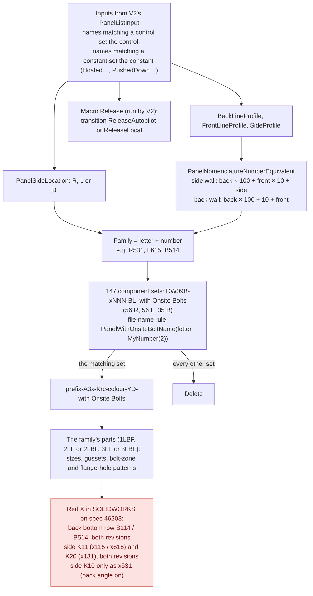
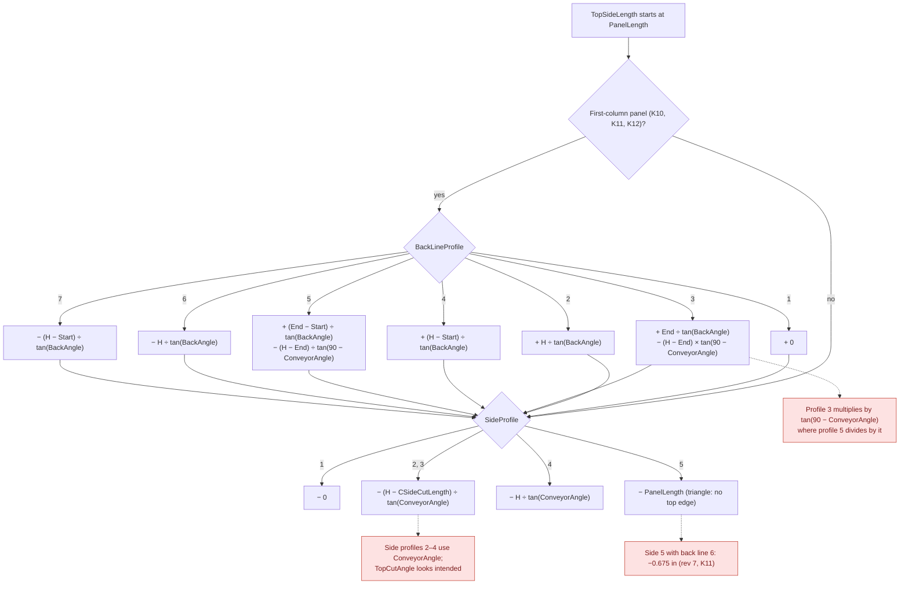
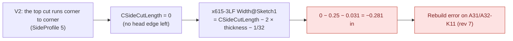

# DW Hopper V2 - Panels: logic diagrams

*Read from the project rules (2026-10-06 export) and replayed with `DwFormEngine` on the 10 panels of spec 46203, rev 6 and rev 7, 2026-10-08.*

DW Hopper V2 - Panels builds one drop-zone panel per spec, hosted by DW Hopper V2 (see [../hopper-v2/logic.md](../hopper-v2/logic.md), section 1). These diagrams show:
- how the inputs V2 sends pick one of the 147 panel shapes;
- how the top edge of a panel is computed;
- where the triangle panels break.

**Red nodes** are problems found. They are explained in [learnings.md](learnings.md). Every input is described in [../inputs/hopper-v2-panels-inputs.md](../inputs/hopper-v2-panels-inputs.md).

## 1. From V2's inputs to one panel family

- **On spec 46203:**
  - side K10 is family 131, or 531 with the back angle;
  - K11 is 115, or 615;
  - K20 is 131;
  - the back's bottom row is B114, or B514 (V2's profile number 124 becomes 114, because the back formula fixes the middle digit at 1);
  - the back's top row is B111, or B611.
- The dimension sweep found no zero or negative value that separates the panels with a red X from the ones without, except the triangle width below. Pattern counts of 0 also appear on panels that build fine (A30-K21/K31).

## 2. Top edge length (TopSideLength)

- H = PanelHeight; Start and End = DimForStart/EndOfBackAngle.
- Neither revision of spec 46203 used side profiles 2–4 or back line 3, so those two suspicions are untested.

## 3. Triangle panels and the C-side flange

- **Likely fix:** delete the C-side part when `SideProfile = 5`, once SOLIDWORKS shows that the family's mates survive without it. Limiting V2's top cut (see [../hopper-v2/logic.md](../hopper-v2/logic.md), section 2) makes these triangles rarer, but K11 can still be one.
