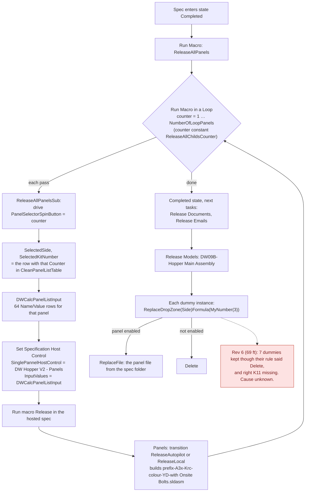
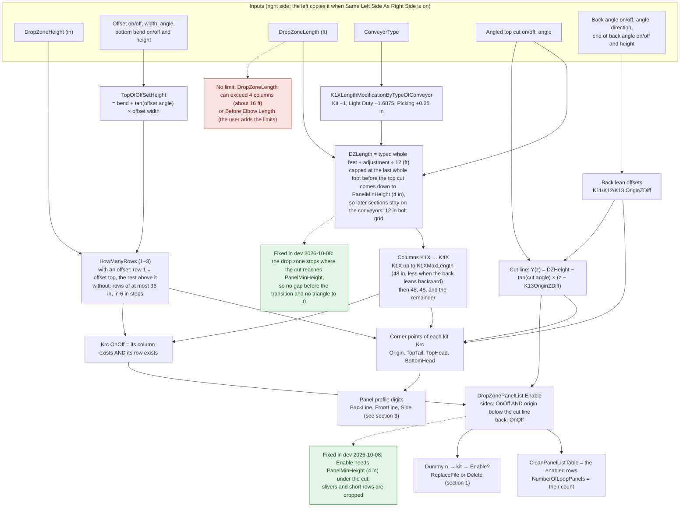
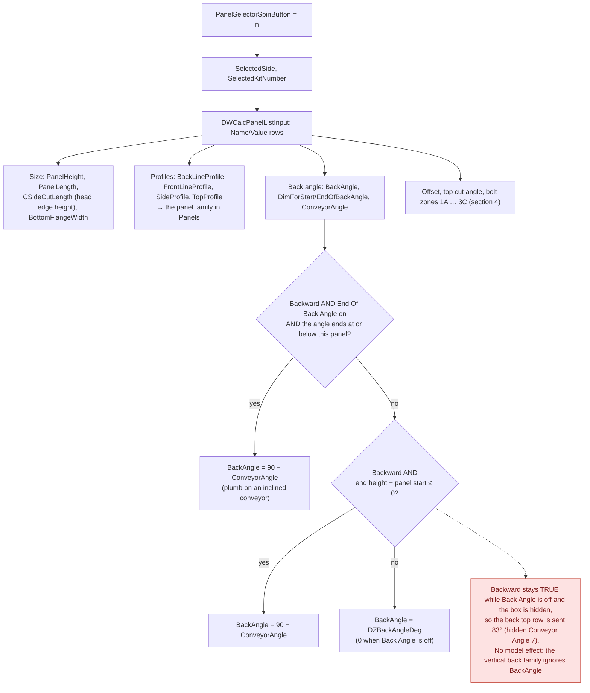
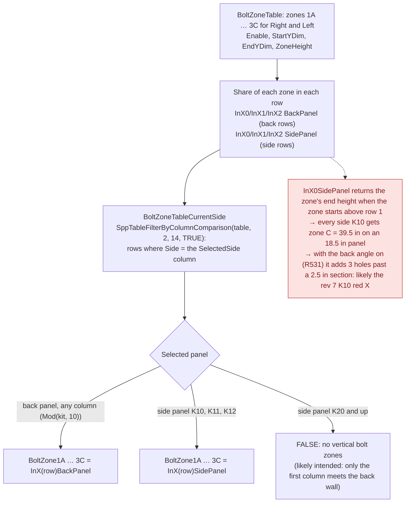
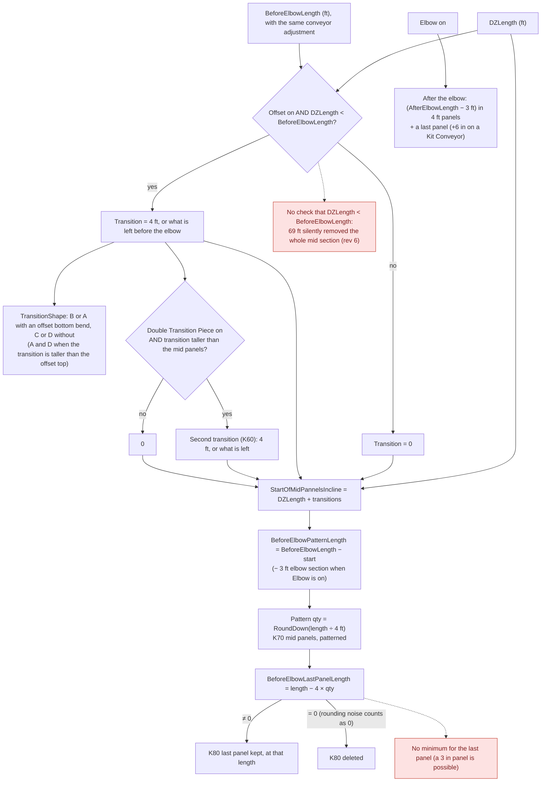

# DW Hopper V2: logic diagrams

*Read from the project rules and replayed with `DwFormEngine` on production spec 46203 (ARD1652 rev 6, ARD1653 rev 7), 2026-10-08.*

These diagrams show how DW Hopper V2 goes from form inputs to the panels it builds. They cover the release loop that hosts DW Hopper V2 - Panels, the drop-zone geometry, the values sent to each panel, the bolt zones, and the sections after the drop zone.

**Red nodes** are problems found on spec 46203. Each one is explained in [learnings.md](learnings.md), and the fixes proposed so far are listed there. The panel project's side is in [../hopper-v2-panels/logic.md](../hopper-v2-panels/logic.md). Every input is described in [../inputs/hopper-v2-inputs.md](../inputs/hopper-v2-inputs.md).

Names in the diagrams are the project's own (variables without `DWVariable`). "K*rc*" is a drop-zone kit: column *r* (1–4, from the back wall) and row *c* (0–2, from the bottom), so K21 is column 2, row 2. Assemblies: A32 right side, A31 left side, A30 back.

## 1. Release: one Panels spec per drop-zone panel



- **Dummy numbering.** The digit runs in `DW09B-Hopper Main Assembly\DW09B-Right Side Drop Zone Assy Dummy-n` are 09, 09 and n, so `MyNumber(3)` is the instance number n. Dummy n is panel n of that side:
  - sides: 1 = K10, 2 = K11, 3 = K12, 4 = K20 … 12 = K42;
  - back: 1 = K10 … 9 = K32.
- **The panel files must exist before V2's model is built.** The loop runs first in the Completed state, then the documents, emails and models.
- **The transition, mid and elbow kits are V2's own parts.** Only the drop-zone panels come from DW Hopper V2 - Panels.

## 2. Drop-zone geometry: which panels exist



- **Spec 46203:** a 24 in side over an 18.5 in offset gives rows of 18.5 and 5.5 in. With a 20° cut, the side reached 0 at 59.1 in, but the drop zone ran to 70.3 in (rev 7), leaving an 11.2 in gap before the 12 in transition.
- **Since 2026-10-08 (dev),** the drop zone stops at the last whole foot before the side drops under 4 in: 4 ft (46.3 in) on rev 7, where the side is 4.66 in. The transition (at 48 in) and mid section (at 96 in) fill the rest, on the 12 in bolt grid.
- **OnOff is not "built".** A panel can be on (its row and column exist) yet sit wholly above the cut. It is then left out by `Enable` only, and its corner variables can be negative.

## 3. What V2 sends each panel (PanelListInput)



- **Profile digits (inferred from the rules):**
  - Front line: 1 plain, 3 side wall with an offset, 4 back wall following the offset.
  - Back line: 1 vertical, 2–7 the back-angle cases (leaning, starting or ending inside the panel).
  - Side: 5 is a triangle under the top cut.
- **Proposed fix for the 83°,** tested by replay: only the two back top panels change, and rev 7 doesn't change at all.
  ```
  DZBackAngleDirectionBackward = If( DWVariableDZBackAngleOnOff = TRUE AND DWVariableDZBackAngleDirection = "Backward" , TRUE , FALSE )
  ```

## 4. Bolt zones



- Back panels' zones add up to their height (24 = 2.5 + 16 + 5.5 on rev 6). Side K10's zones add an extra 39.5 in, the back wall's height.
- `SppTableFilterByColumnComparison` is a Pro Server function, so `DwFormEngine` needs a stand-in. See [../../learnings.md](../../learnings.md), 2026-10-08.

## 5. After the drop zone: transition, mid panels, elbow



- **Rev 7 (6 ft drop zone, 18 ft before the elbow):** transition B 4 ft, two K70 pattern copies, last panel 0, so K80 is deleted. All of this matched the SOLIDWORKS tree.
